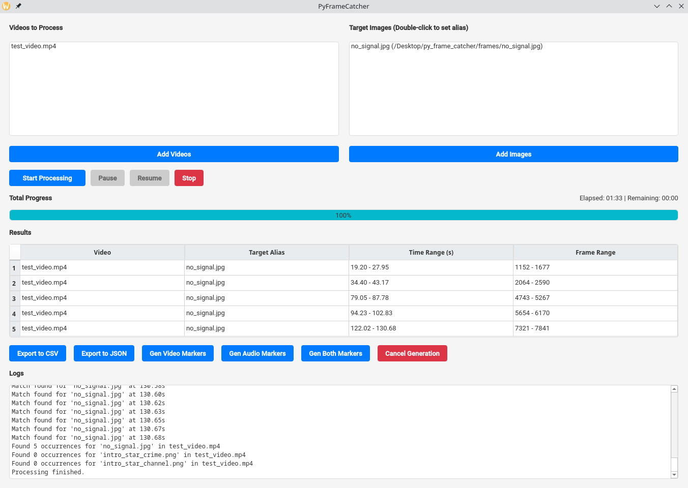

# PyFrameCatcher

PyFrameCatcher is a powerful desktop application built with Python, PyQt6, and OpenCV, designed to identify specific frames within video files based on target images. It's ideal for video analysis, content moderation, or any task requiring precise frame-matching across multiple video sources.

## 🚦 Use Case

You have a video and you want to find specific frames in it (beggining and end of add block, no signal, video intro, credits, etc.). You can use this application to find those frames and export them as a video or audio file (or both) and use them as markers for video editing in your preffered video editor. No need to manually go through the video and find those frames. You only need to provide the target images (screenshots) and the application will do the rest.



## 🚀 Features

-   **Multi-Video Processing:** Queue and process multiple video files in a single session.
-   **Target Image Matching:** Define one or more target images (with custom aliases) to search for within videos.
-   **Configurable Accuracy:** Adjust the matching threshold to fine-tune sensitivity.
-   **Real-time Progress:** Track processing status with a visual progress bar and detailed logs.
-   **Range Detection:** Automatically groups consecutive matching frames into time ranges.
-   **Marker Generation:** Export results into "marker" files (Video, Audio, or both).
    -   **Video Markers:** A video containing the matched frames at their original timestamps against a black background.
    -   **Audio Markers:** Audio tones (1kHz beeps) marking the start and end of matched ranges.
-   **Cross-Platform:** Runs on Linux, Windows, and macOS (anywhere Python and PyQt6 are supported).

## 🛠 Requirements

-   **Python:** 3.8 or higher.
-   **Libraries:** 
    -   `opencv-python`
    -   `PyQt6`
    -   `numpy`
-   **System Tools:** `ffmpeg` (required for marker generation/exporting).

## 📦 Installation

1.  **Clone the repository:**
    ```bash
    git clone https://github.com/antoan-m/PyFrameCatcher.git
    cd PyFrameCatcher
    ```

2.  **Install dependencies:**
    ```bash
    pip install -r requirements.txt
    ```

3.  **Install FFmpeg:**
    -   **Ubuntu/Debian:** `sudo apt install ffmpeg`
    -   **Fedora/RHEL:** `sudo dnf install ffmpeg`
    -   **Arch Linux:** `sudo pacman -S ffmpeg`
    -   **macOS (Homebrew):** `brew install ffmpeg`
    -   **Windows:** Download from [ffmpeg.org](https://ffmpeg.org/download.html) and add to your PATH.

## 🚦 Usage

Launch the application using the provided entry point:

- Via Terminal:
```bash
python run_gui.py
```
- Via Shortcut:
```bash
double-clickrun_gui.py

### Workflow:
1.  **Add Videos:** Use the "Add Videos" button to select the source files you want to scan.
2.  **Add Target Images:** Use "Add Images" to select the frames you're looking for.
    -   *Tip: Double-click an image in the list to set a custom alias (e.g., "Intro Logo").*
3.  **Adjust Threshold:** (Optional) Use the slider to set how closely a frame must match the target.
4.  **Start Processing:** Click "Start" to begin the scan. You can pause or stop at any time.
5.  **View & Export (Optional):** Once finished, the results table will show all matches. If needed, click "Export Marker File" to generate a video/audio reference file using FFmpeg.

## 🧪 Running Tests

The project includes a comprehensive test suite using `pytest`.

```bash
pytest
```

## ⚖️ License

This project is licensed under the **GNU General Public License v3.0**. See the [LICENSE](LICENSE) file for the full text.